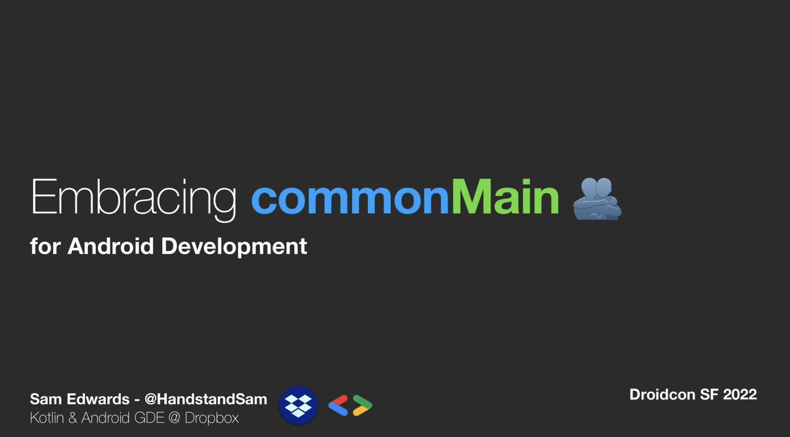

# 🆓 kmp4free
[](https://github.com/handstandsam/kmp4free/blob/main/LICENSE)
[](https://repo1.maven.org/maven2/com/handstandsam/kmp4free/kmp4free/)
[](https://s01.oss.sonatype.org/content/repositories/snapshots/com/handstandsam/kmp4free/com.handstandsam.kmp4free.gradle.plugin/)
[](https://github.com/handstandsam/kmp4free/actions?query=branch%3Amain)

Allows you to toggle between Kotlin JVM Plugin -> Kotlin Multiplatform with a Gradle Property `kmp4free=true`.

This Gradle Plugin was built to support gradual adoption of Kotlin Multiplatform.  It's called `kmp4free` because you are able to take a normal Kotlin JVM module, and with a single line change, enable or disable the Kotlin Multiplatform Plugin.

There is always a risk of adding something new, especially with a large project. The introduction of a technology that is not at a stable version yet can block the adoption of a new technology.  The goal of this plugin is to reduce risk to a single line change.

## Plugin Installation
Add the Snapshot Repo in your project's `settings.gradle.kts`
```kotlin
pluginManagement {
    repositories {
        // ...
        maven { url = "https://s01.oss.sonatype.org/content/repositories/snapshots/" }
    }
}
```

Add the Plugin on your project's `build.gradle.kts`
```kotlin
plugins {
    id("com.handstandsam.kmp4free") version "${latest_version}"
}
```

## Usage
Just replace `kotlin("jvm")` with `id("com.handstandsam.kmp4free")` in the `plugins` block of your module's `build.gradle.kts` file.

### Enabling Multiplatform
You can set `kmp4free=true` in your `gradle.properties` or send it in as a command-line parameter to gradle with `-Pkmp4free=true`.

This enables property the Kotlin Multiplatform Plugin, along with the additional changes required to support seamless switching between the Kotlin JVM Plugin.

Any code in the `main` sourceSet needs to be `commonMain` compatible when `multiplatform` is enabled, otherwise the build will fail about not being able to resolve JVM dependencies.  This isn't a bad thing though, as you will then be able to identify what you need to change to make your code multiplatform compatible.

#### SourceSet Mapping
* `src/main` ➡️ `src/commonMain`
* `src/test` ➡️ `src/jvmTest`

#### Configuration Mapping
* `implementation` ➡️ `commonMainImplementation`
* `api` ➡️ `commonMainApi`
* `testImplementation` ➡️ `jvmTestImplementation`
* `testApi` ➡️ `jvmTestApi`

When tests are already written with JVM Libraries like JUnit and Google's Truth library, it would be a lot of work to migrate those tests over to `commonTest`, so these tests will only run on the JVM with `kmp4free`.  Additionally, this task alias means that your scripts that run Gradle Tasks do not have to update either when the plugin is enabled, since the `test` task will be available.

#### Task Aliasing
* `:module:test` ➡️ `:module:jvmTest`

## Disabling Multiplatform
This uses the Kotlin JVM Plugin, and bypasses Kotlin Multiplatform entirely.

#### SourceSet Mapping
* `src/commonMain` ➡️ `src/main`
* `src/jvmMain` ➡️ `src/main`
* `src/commonTest` ➡️ `src/test`
* `src/jvmTest` ➡️ `src/test`


#### Configuration Mapping
* `commonMainImplementation` ➡️ `implementation`
* `commonMainApi` ➡️ `api`
* `commonTestImplementation` ➡️ `testImplementation`
* `commonTestApi` ➡️ `testApi`
* `jvmTestImplementation` ➡️ `testImplementation`
* `jvmTestApi` ➡️ `testApi`

You can set the following properties in your `gradle.properties`

## Related Content

Droidcon SF Presentation: [Embracing `commonMain` for Android Development](https://speakerdeck.com/handstandsam/embracing-commonmain-for-android-development-droidcon-sf-2022)

[](https://speakerdeck.com/handstandsam/embracing-commonmain-for-android-development-droidcon-sf-2022)

## FAQ

#### Why do I need to use `maybeCreate()`?
You may typically see source sets defined like `val commonMain by getting`.  Because with `kmp4free` we toggle the multiplatform plugin on/off, that Source Set will be sometimes be already there, and other times may not be. Therefore we use `maybeCreate("commonMain")` to avoid the error.

#### What Configurations are Mapped?
* api
* implementation
* compileOnly
* runtimeOnly
* apiDependenciesMetadata
* implementationDependenciesMetadata
* compileOnlyDependenciesMetadata
* runtimeOnlyDependenciesMetadata

#### Can I use `kmp4free` on an Android Library?

No. `kmp4free` is a step in the journey of migrating a `kotlin("jvm")` module to `kotlin("multiplatform")` with a `commonMain` SourceSet without adding any plugin changes when disabled.

The reason why you can't is because a `kotlin("jvm")` module means you cannot have resources in the `res` directory, an `AndroidManifest.xml` and not use Android APIs.  You may find that your Android Library doesn't have any of those.  If that's true, just convert it to a `kotlin("jvm")` module, and then you can use the plugin!

See [Issue #6](https://github.com/handstandsam/kmp4free/issues/6) for more discussion on this topic.


#### How do I configure my Source Sets?
You are able to use `jvm` or `multiplatform` style configuration.  Note: will want to use the `maybeCreate("commonMain")` call instead of `val commonMain by getting` when accessing Source Sets.

That is because sometimes the configuration is there when enabled, but off when disabled.  When you are ready, you can migrate away from the `kmp4free` plugin and start using the standard `kotlin("jvm")` project with just a `jvm()` target.

#### How do I configure my iOS and JS Targets?

You can only apply your configuration IF the `kotlin("multiplatform")` plugin has been added.  That is because this plugin allows it to be on & off.

Look up the `KotlinMultiplatformExtension`, and if not null (Checked by the `?.` operator), you can supply your configuration like this:
```kotlin
import org.jetbrains.kotlin.gradle.dsl.KotlinMultiplatformExtension

project.extensions.findByType(KotlinMultiplatformExtension::class.java)?.apply {
    ios()
}
```

You can find more information in [Issue #2](https://github.com/handstandsam/kmp4free/issues/2).  I'm thinking this would be a lambda in the plugin configuration block for each target.
